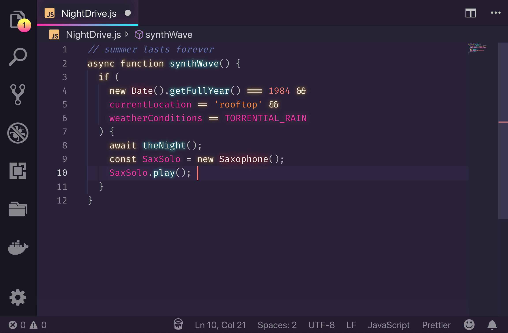

# SynthWave '84 - VS Code theme
Do you remember that endless summer back in '84? Cruising down the ocean-highway with the top down, the wind in our hair and heads buzzing with neon dreams? 

No, I don't remember it either, but with this experimental theme we can go there.



This colour scheme is influenced by the music and the cover artwork of modern Synthwave bands like FM-84, Timecop 1983 and The Midnight. By association, that means I've also taken heavy influence from the excellent [retro-tinged artwork of James White](https://signalnoise.com/) (check out his work, it's awesome).

## But...why?
I was a kid in the 80s but for most of my teenage life I strongly disliked nearly everything about the 80s aesthetic of my childhood. It was like, _so lame_. With the hindsight of recent years though, I've realised that it was actually pretty sweet and I wanted to celebrate it a little. 

Much the same way, in the modern web-development world of shaders, React and WebGL, I feel like it's easy to forget that the basics are actually pretty damn good. To that end, this theme goes back to basics - No Shader magic. No cloud-streamed WebGL render-farms. Just plain CSS :)

## Installation
You can enable the base theme as you would any other theme, but the gratuitous 80s glow is still experimental and needs a little extra work to get it going:

### To enable the glow

Download this [excellent plugin that allows you to load custom CSS and JS](https://github.com/be5invis/vscode-custom-css).

Copy `synthwave84.css` to a location on your machine, such as your user folder. Copy the file path and add it to your VS code `settings.json`. On Mac it might look something like the snippet below:

```
{
  "vscode_custom_css.imports": [
    "file:///Users/{your username}/synthwave84.css"
    ]
}
```

**Important**: Make sure you include the file protocol in the path i.e. `file://`

Open your command pallete with `Ctrl + Shift + P` or `Shift + ⌘ + P` and choose "Enable custom CSS and JS". It will prompt you to restart, and when you do the lights should be on :)

**NOTE: Every time you update VS code, you will need to repeat this step to re-enable custom CSS and JS. Similarly, when the theme updates, you will need to copy the updated css to your chosen location**

### Font
I haven't included a font in this release as I know that it's a very personal preference. The font I use (that is seen in the image above) is [Fira Code](https://github.com/tonsky/FiraCode), which I recommend if you're a fan of ligatures.


## Uninstallation
I fully acknowledge that this probably isn't great for long term coding sessions. Sure, it's a novelty for a while but neon isn't so easy on the eyes. If you decide to change to a different theme, you will first need to disable the custom css.

Open your command pallete with `Ctrl + Shift + P` or `⇧⌘P` and choose "Disable custom CSS".

You may also wish to remove the file path from your `settings.json`.

## Compatibility
This theme is **very much a work in progress**. I primarily develop in HTML & CSS, JS, React and Elixir so, whilst those language sets should look pretty good, there will likely be issues for other languages. I'll work on adding more support as I go. If you find anything glaringly wrong, raise an issue and I'll try to fix it as soon as I can.


## Thanks
Lastly, I couldn't have made this if it weren't for the fantistic work of [Sarah Drasner](https://twitter.com/sarah_edo). Her [tutorial on theming for CSS tricks](https://css-tricks.com/creating-a-vs-code-theme/) was a huge help in developing this 🙏

Similarly, I'd like to thanks [Wes Bos](https://twitter.com/wesbos) for his [cool Cobalt2 theme](https://github.com/wesbos/cobalt2-vscode). His readme helped me figure out how to package this hot mess for public use 👍

If this theme is too much for you, and I don't blame you, then I recommend [Horizon](https://github.com/jolaleye/horizon-theme-vscode) for a similar, yet more understated, retro vibe. It's beautiful.
