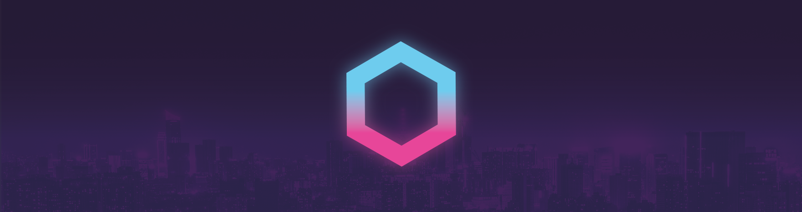
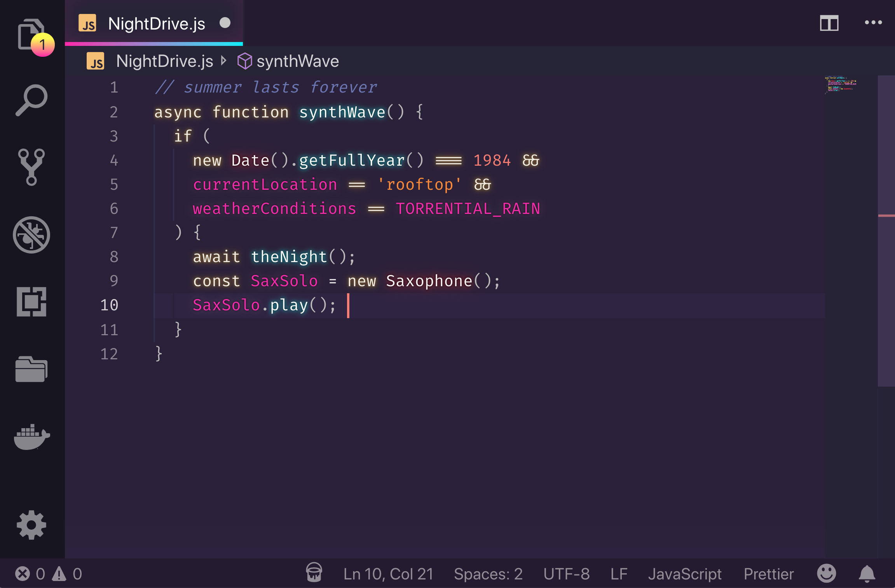

# SynthWave '84 - VS Code theme


Do you remember that endless summer back in '84? Cruising down the ocean-highway with the top down, the wind in our hair and heads buzzing with neon dreams? 

No, I don't remember it either, but with this experimental theme we can go there.



This colour scheme is influenced by the music and the cover artwork of modern Synthwave bands like FM-84, Timecop 1983 and The Midnight. By association, that means I've also taken heavy influence from the excellent [retro-tinged artwork of James White](https://signalnoise.com/) (check out his work, it's awesome).

## But...why?
I was a kid in the 80s but for most of my teenage life I strongly disliked nearly everything about the 80s aesthetic of my childhood. It was like, _so lame_. With the hindsight of recent years though, I've realised that it was actually pretty sweet and I wanted to celebrate it a little. 

Much the same way, in the modern web-development world of shaders, React and WebGL, I feel like it's easy to forget that the basics are actually pretty damn good. To that end, this theme goes back to basics - No Shader magic. No cloud-streamed WebGL render-farms. Just plain CSS :)

## Installation
To begin with, [install the base theme from the VS Marketplace](https://marketplace.visualstudio.com/items?itemName=RobbOwen.synthwave-vscode). This is the way Synthwave '84 is intended to be used day-to-day. If you want to enable the gratuitous 80s glow, it needs a little extra work to get it going. 

VS code doesn't natively support text effects and as a result, the glow is experimental. It's likely to be buggy and, whilst it looks rad, it isn't intended for extended use. 

If you do decide use the glow effect, you do so at your own risk. Bring your Sunglasses. Here be (laser)dragons.

### To enable the glow
Install this [excellent plugin that allows you to load custom CSS and JS](https://marketplace.visualstudio.com/items?itemName=be5invis.vscode-custom-css) from the VS Marketplace. **Please carefully read the ReadMe regarding permission for that extension before continuing with this installation.**

Locate [`synthwave84.css`](https://github.com/robb0wen/synthwave-vscode/blob/master/synthwave84.css) either in this extension's VS code install directory, or [directly from the github repo](https://github.com/robb0wen/synthwave-vscode/blob/master/synthwave84.css). Alternatively, if you want the browser chrome updates without the text glow you can use [`synthwave84-noglow.css`](https://github.com/robb0wen/synthwave-vscode/blob/master/synthwave84-noglow.css).

Copy your chosen CSS file to a location on your machine, such as your user folder. Copy the file path and add it to your VS code `settings.json`. On Mac it might look something like the snippet below:

```
{
  "vscode_custom_css.imports": [
    "file:///Users/{your username}/synthwave84.css"
    ]
}
```

Windows might resemble:

```
{
  "vscode_custom_css.imports": [
    "file:///C:/Users/{your username}/synthwave84.css"
    ]
}
```

**Important**: Make sure you include the file protocol in the path i.e. `file://`

Open your command palette with `Ctrl + Shift + P` or `Shift + ⌘ + P` and choose "Enable custom CSS and JS". It will prompt you to restart, and when you do the lights should be on :)

At this point, VS Code may pop up a message to say that it is corrupted, this is caused by the [custom CSS & JS extension](https://marketplace.visualstudio.com/items?itemName=be5invis.vscode-custom-css) and not this theme. As their installation instructions say, you can click "Don't show again" to dismiss the popup.

## Updates
Every time you update VS code, you will need to repeat this step to re-enable custom CSS and JS. Similarly, when the theme updates, you will need to copy the updated css to your chosen location. 

This is less than ideal, but until VS code add the option to use custom CSS natively, it's unfortunately the only option.

## Disabling the glow and uninstallation
The glow effect started as a joke and was never intended for long-term coding sessions. If you want to turn it off, you can disable it at any time by opening your command palette with `Ctrl + Shift + P` or `Shift + ⌘ + P` and choose "Disable custom CSS".

If you decide to change to a different theme altogether, you will also need to disable the custom css in this way. You may also wish to remove the file path from your `settings.json`.

### Font
I haven't included a font in this release as I know that it's a very personal preference. The font I use (that is seen in the image above) is [Fira Code](https://github.com/tonsky/FiraCode), which I recommend if you're a fan of ligatures.

## Compatibility
This theme is **very much a work in progress**. I primarily develop in HTML & CSS, JS, React and Elixir so, whilst those language sets should look pretty good, there will likely be issues for other languages. I'll work on adding more support as I go. If you find anything glaringly wrong, raise an issue and I'll try to fix it as soon as I can.

## Contributing
I'm really happy to consider any contributions to this theme. Before you make any changes, [please read the contribution guide](https://github.com/robb0wen/synthwave-vscode/blob/master/CONTRIBUTING.md).

## Thanks
Lastly, I couldn't have made this if it weren't for the fantastic work of [Sarah Drasner](https://twitter.com/sarah_edo). Her [tutorial on theming for CSS tricks](https://css-tricks.com/creating-a-vs-code-theme/) was a huge help in developing this 🙏

Similarly, I'd like to thanks [Wes Bos](https://twitter.com/wesbos) for his [cool Cobalt2 theme](https://github.com/wesbos/cobalt2-vscode). His readme helped me figure out how to package this hot mess for public use 👍

If this theme is too much, then I recommend [Horizon](https://github.com/jolaleye/horizon-theme-vscode), or [City Lights](http://citylights.xyz/) for a similar, yet more understated, retro vibe. They're both beautiful.

Banner cityscape image from [Unsplash](https://unsplash.com/photos/DxHR8K5Egjk)
